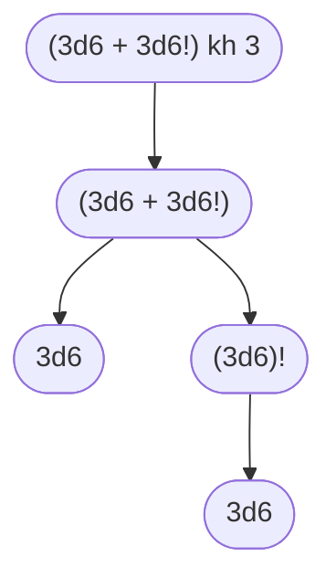
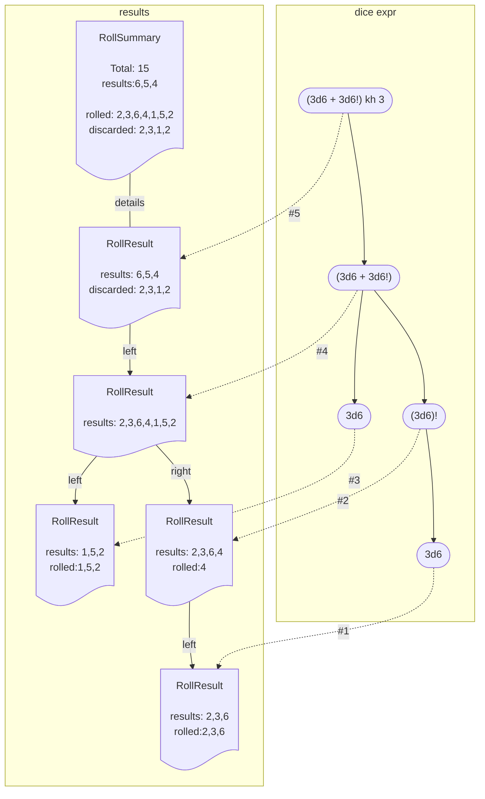

# dart_dice_parser
[](https://pub.dartlang.org/packages/dart_dice_parser)
[](https://github.com/Adventuresmith/dart-dice-parser/actions/workflows/dart.yml)
[](https://codecov.io/gh/Adventuresmith/dart-dice-parser)
[](CODE_OF_CONDUCT.md)
[](https://pub.dev/packages/lint)


A dart library for parsing dice notation (`2d6+4`). Supports advantage/disadvantage, counting success/failures, 
exploding, compounding, and other variations.

# Example

```dart

import 'package:dart_dice_parser/dart_dice_parser.dart';

void main() {
  // Create a roller for D20 advantage (roll 2d20, keep highest).
  final d20adv = DiceExpression.create('2d20 kh');

  stdout.writeln(d20adv.roll());
  // outputs:
  //  ((2d20) kh ) ===> RollSummary(total: 16, results: [16], metadata: {rolled: [4, 16], discarded: [4]})

  stdout.writeln(d20adv.roll());
  // outputs:
  //  ((2d20) kh ) ===> RollSummary(total: 19, results: [19], metadata: {rolled: [13, 19], discarded: [13]})
}
```

# Dice Notation

## Examples:

* `2d20 #cf #cs`
  * roll 2d20, result will include counts of critical successes (20) and failures (1)

* advantage
    * `2d20-L` -- drop lowest 
    * `2d20k`, `2d20kh` -- keep highest
* disadvantage
    * `2d20-H` -- drop highest
    * `2d20-kl` -- keep lowest
* `(2d10+3d20)-L3` -- roll 2d10 and 3d20, combine the two results lists, and drop lowest 3 results
* `20d10-<3->8#` -- roll 20 d10, drop any less than 3 or greater than 8 and count the number of remaining dice


## Supported notation

* `2d6` -- roll `2` dice of `6` sides
* special dice variations:
  * `4dF` -- roll `4` fudge dice (sides: `[-1, -1, 0, 0, 1, 1]`)
  * `1d%` -- roll `1` percentile dice (equivalent to `1d100`)
  * `1D66` -- roll `1` D66, aka `1d6*10 + 1d6` 
    * **_NOTE_**: you _must_ use uppercase `D66`, lowercase `d66` will be interpreted as a 66-sided die
  
* exploding dice
  * `4d6!` -- roll `4` `6`-sided dice, explode if max (`6`) is rolled (re-roll and include in results)
    * `4d6 !=5` or `4d6!5` -- explode a roll if equal to 5 
    * `4d6 !>=4` - explode if >= 4
    * `4d6 !<=2` - explode if <=2
    * `4d6 !>5` - explode if > 5
    * `4d6 !<2` - explode if <2
    * To explode only once, use syntax `!o` 
      * `4d6 !o<5`
* compounding dice (Shadowrun, L5R, etc). Similar to exploding, but the additional rolls for each
  dice are added together as a single "roll". The original roll is replaced by the sum of it and any additional rolls.
  * `5d6 !!` -- roll `5` `6`-sided dice, compound
    * `5d6 !!=5` or `5d6!5` -- compound a roll if equal to 5 
    * `5d6 !!>=4` - compound if >= 4
    * `5d6 !!<=4` - compound if <= 4
    * `5d6 !!>5` - compound if > 5
    * `5d6 !!<3` - compound if < 3
    * To compound only once, use syntax `!!o` 
      * `5d6 !!o<2`
* re-rolling dice:
  * `4d4 r2` -- roll 4d4, re-roll any result = 2
  * `4d4 r=2` -- roll 4d4, re-roll any result = 2
  * `4d4 r<=2` -- roll 4d4, re-roll any <= 2
  * `4d4 r>=3` -- roll 4d4, re-roll any >= 3
  * `4d4 r<2` -- roll 4d4, re-roll any < 2
  * `4d4 r>3` -- roll 4d4, re-roll any > 3
  * To reroll only once, use syntax `ro` 
    * `4d4 ro<2`
* keeping dice:
  * `3d20 k 2` -- roll 3d20, keep 2 highest
  * `3d20 kh 2` -- roll 3d20, keep 2 highest
  * `3d20 kl 2` -- roll 3d20, keep 2 lowest
* dropping dice:
  * `4d6 -H` -- roll 4d6, drop 1 highest
  * `4d6 -L` -- roll 4d6, drop 1 lowest
  * `4d6 -H2` -- roll 4d6, drop 2 highest
  * `4d6 -L2` -- roll 4d6, drop 2 lowest
  * `4d6 ->5` -- roll 4d6, drop any results > 5
  * `4d6 -<2` -- roll 4d6, drop any results < 2
  * `4d6 ->=5` -- roll 4d6, drop any results >= 5
  * `4d6 -<=2` -- roll 4d6, drop any results <= 2
  * `4d6 -=1` -- roll 4d6, drop any results equal to 1
  * NOTE: the drop operators have higher precedence than
    the arithmetic operators; `4d10-L2+2` is equivalent to `(4d10-L2)+2`
  * NOTE: drop is not subtraction. 
    * `4d6 - 3` -- roll 4d6, subtract 3
    * `4d6 - 2d6` -- roll 4d6, subtract the result of rolling 2d6
* cap/clamp:
  * `4d20 C<5` -- roll 4d20, change any value < 5 to 5
  * `4d20 C>15` -- roll 4d20, change any value > 15 to 15

* scoring dice rolls:
  * counting:
    * `4d6 #` -- how many results? 
      * For example, you might use this to count # of dice above a target. `(5d10 -<6)#` -- roll 5 d10, drop any less than 6, count results
    * `4d6 #>3` -- roll 4d6, count any > 3
    * `4d6 #<3` -- roll 4d6, count any < 3
    * `4d6 #>=5` -- roll 4d6, count any >= 5
    * `4d6 #<=2` -- roll 4d6, count any <= 2
    * `4d6 #=5` -- roll 4d6, count any equal to 5
  * successes and failures 
    * A normal count operation `#` discards the rolled dice and changes the result to be the count 
      * For example, `2d6#<=3` rolls `[3,4]` then counts which results are `<=3` , returning `[1]`
    * But, sometimes you want to be able to count successes/failures without discarding the dice rolls. 
      In this case, use modifiers `#s`, `#f`, `#cs`, `#cf` to add metadata to the results.
      * `6d6 #f<=2 #s>=5 #cs6 #cf1` -- roll 6d6, count results <= 2 as failures, >= 5 as successes, =6 as critical successes, =1 as critical failures
        * The above returns a result like: `RollSummary(total: 22, results: [6, 2, 1, 5, 3, 5], metadata: {rolled: [6, 2, 1, 5, 3, 5], score: {successes: [6, 5, 5], failures: [2, 1], critSuccesses: [6], critFailures: [1]}})`
    * NOTE: order matters
      * `2d20 kh #cf #cs` -- roll 2d20, keep the highest, count critical successes & failures. If this 
         rolled `[1,18]`, the `1` is dropped and the result metadata won't record a critical failure.
         If that's not the behavior you want, move the counts prior to the drop (`2d20 #cf #cs kh`).
      
* arithmetic operations
  * parenthesis for order of operations
  * addition is a little special -- could be a sum of ints, or it can be used to aggregate results of multiple dice rolls
    * Addition of integers is the usual sum
      * `4+5` 
      * `2d6 + 1`
    * Addition of roll results combines the results (use parens to ensure the order of operations is what you desire)
      * `(5d6+5d10)-L2` -- roll 5d6 and 5d10, and from aggregate results drop the lowest 2.
      * `5d6+5d10-L2` -- roll 5d6 and 5d10, and from only the 5d10 results drop the lowest 2. equivalent to `5d6+(5d10-L2)`
  * `*` for multiplication
  * `-` for subtraction
  * numbers must be integers
  * division is not supported.


# Random Number Generator

By default, Random.secure() is used. You can select other RNGs when creating the
dice expression. Random() will be faster than Random.secure(); if you're doing lots of rolls
for use cases where security doesn't matter, you will want to use Random().

For example, you might create a dice-rolling app that both provides rolls _and_ displays statistics
(mean, stddev, etc) about the dice expression. To do that, you might create two separate
`DiceExpression` objects for the same user-input -- one with the secure RNG (run whenever a user
clicks a button), and the second to display min/max/mean/stddev/etc

```dart 
  final diceExpr_SecureRNG = DiceExpression.create('2d6');
  final diceExpr_FastRNG = DiceExpression.create('2d6', Random());
  
  //....
  // on button-click, roll the dice
  final roll = diceExpr_SecureRNG.roll();
  
  //....
  // when dice expr changes, update the stats graph. 
  final stats = await diceExpr_FastRNG.stats();
  // output of stats: {mean: 6.98, stddev: 2.41, min: 2, max: 12, count: 10000, histogram: {2: 310, 3: 557, 4: 787, 5: 1090, 6: 1450, 7: 1646, 8: 1395, 9: 1147, 10: 825, 11: 526, 12: 267}}

```

# CLI Usage

There's no executable in bin, but there's an example CLI at `example/main.dart`. 

Usage:
```
❯ dart run example/main.dart -h
Usage:
-n, --num                       Number of times to roll the expression
                                (defaults to "1")
-o, --output                    output type

          [json]                output JSON
          [plain] (default)     output using toString
          [pretty]              output result summary and detailed results of evaluating the expression tree

-r, --random                    Random number generator to use.

          [<integer>]           pseudorandom generator initialized with given seed
          [pseudo] (default)    pseudorandom generator
          [secure]              secure random

-v, --[no-]verbose              Enable verbose logging
-s, --[no-]stats                Output statistics for the given dice expression. Uses n=10000 unless overridden
-h, --[no-]help                 

```

Examples:

```console
❯ dart example/main.dart '3d6'
(3d6) ===> RollSummary(total: 13, results: [3, 6, 4], metadata: {rolled: [3, 6, 4]})


# run N number of rolls
❯ dart run example/main.dart -n5 '3d6'
(3d6) ===> RollSummary(total: 10, results: [2, 2, 6], metadata: {rolled: [2, 2, 6]})
(3d6) ===> RollSummary(total: 12, results: [6, 4, 2], metadata: {rolled: [6, 4, 2]})
(3d6) ===> RollSummary(total: 5, results: [2, 1, 2], metadata: {rolled: [2, 1, 2]})
(3d6) ===> RollSummary(total: 10, results: [5, 3, 2], metadata: {rolled: [5, 3, 2]})
(3d6) ===> RollSummary(total: 13, results: [4, 5, 4], metadata: {rolled: [4, 5, 4]})


# show statistics for a dice expression
❯ dart example/main.dart  -s '3d6'
{mean: 10.5, stddev: 2.97, min: 3, max: 18, count: 10000, histogram: {3: 49, 4: 121, 5: 273, 6: 461, 7: 727, 8: 961, 9: 1153, 10: 1182, 11: 1272, 12: 1151, 13: 952, 14: 733, 15: 486, 16: 289, 17: 154, 18: 36}}

```

Sometimes it's nice to change the output type so you can see the graph of results:
```console
# show the result graph:
❯ dart run example/main.dart -o pretty '3d6 #cs #cf'
(((3d6) #cs ) #cf ) ===> RollSummary(total: 13, results: [1, 6, 6], metadata: {rolled: [1, 6, 6], score: {critSuccesses: [6, 6], critFailures: [1]}})
  (((3d6) #cs ) #cf ) =count=> RollResult(total: 13, results: [1, 6, 6], metadata: {score: {critFailures: [1]}})
      ((3d6) #cs ) =count=> RollResult(total: 13, results: [1, 6, 6], metadata: {score: {critSuccesses: [6, 6]}})
          (3d6) =rollDice=> RollResult(total: 13, results: [1, 6, 6], metadata: {rolled: [1, 6, 6]})


❯ dart run example/main.dart -o json '3d6 #cs #cf'
{"expression":"(((3d6) #cs ) #cf )","total":9,"results":[2,3,4],"detailedResults":{"expression":"(((3d6) #cs ) #cf )","opType":"count","nsides":6,"ndice":3,"results":[2,3,4],"left":{"expression":"((3d6) #cs )","opType":"count","nsides":6,"ndice":3,"results":[2,3,4],"left":{"expression":"(3d6)","opType":"rollDice","nsides":6,"ndice":3,"results":[2,3,4],"metadata":{"rolled":[2,3,4]}}}},"metadata":{"rolled":[2,3,4]}}


```

## Statistics output


I often wonder, "what range of values should I expect?" or "how likely will this roll explode or compound?" 

To explore that, you can use stats output: 

```console

# roll 4d6
❯ dart run example/main.dart -s '4d6'
{mean: 14.0, stddev: 3.44, min: 4, max: 24, count: 10000, histogram: {4: 5, 5: 28, 6: 72, 7: 163, 8: 280, 9: 468, 10: 573, 11: 816, 12: 948, 13: 1069, 14: 1047, 15: 1118, 16: 1010, 17: 786, 18: 637, 19: 412, 20: 278, 21: 161, 22: 84, 23: 32, 24: 13}}


# roll 4d6 explode 
❯ dart run example/main.dart -s '4d6!'
{mean: 16.7, stddev: 6.46, min: 4, max: 54, count: 10000, histogram: {4: 6, 5: 32, 6: 87, 7: 166, 8: 264, 9: 403, 10: 558, 11: 655, 12: 690, 13: 734, 14: 695, 15: 651, 16: 621, 17: 607, 18: 498, 19: 507, 20: 425, 21: 350, 22: 353, 23: 260, 24: 229, 25: 194, 26: 167, 27: 150, 28: 143, 29: 118, 30: 99, 31: 69, 32: 53

# roll 4d5 compounding 
❯ dart run example/main.dart -s '4d6!!'
{mean: 16.8, stddev: 6.43, min: 4, max: 58, count: 10000, histogram: {4: 6, 5: 29, 6: 78, 7: 162, 8: 230, 9: 389, 10: 506, 11: 635, 12: 726, 13: 705, 14: 751, 15: 682, 16: 597, 17: 602, 18: 571, 19: 498, 20: 456, 21: 365, 22: 310, 23: 286, 24: 262, 25: 192, 26: 167, 27: 156, 28: 114, 29: 92, 30: 76, 31: 72, 32: 57, 33: 41, 34: 32, 35: 31, 36: 20, 37: 15, 38: 16, 39: 10, 40: 12, 41: 8, 42: 10, 43: 4, 44: 8, 45: 5, 46: 4, 47: 2, 48: 1, 49: 2, 50: 3, 51: 2, 53: 1, 58: 1}}

```

Or, if I wonder, "in those rolls, how many times might I see a roll >=6?". For that case, I can include a count operation


```console
❯ dart run example/main.dart -s '4d6 #>=6'
{mean: 0.664, stddev: 0.75, min: 0, max: 4, count: 10000, histogram: {0: 4871, 1: 3781, 2: 1192, 3: 144, 4: 12}}

❯ dart run example/main.dart -s '4d6! #>=6'
{mean: 0.793, stddev: 0.973, min: 0, max: 7, count: 10000, histogram: {0: 4846, 1: 3213, 2: 1328, 3: 449, 4: 116, 5: 40, 6: 4, 7: 4}}

❯ dart run example/main.dart -s '4d6!! #>=6'
{mean: 0.665, stddev: 0.747, min: 0, max: 4, count: 10000, histogram: {0: 4840, 1: 3845, 2: 1144, 3: 164, 4: 7}}
```


# Reacting to dice rolls in your application

If you're using this package within an app, you probably want to display dice-rolling events to the user.

There's a couple ways for you to act on roll results. Depending on your use-case, one or more will hopefully fit your needs.

## Traversing the result graph
Use the 'left' and 'right' fields of each RollResult node to walk the graph. For an example, see [simple.dart](example/simple.dart)

When a dice expression is parsed, it creates a binary tree to evaluate the roll. 

For example, the expression `(3d6 + 3d6!) kh3` means "roll 3d6 and 3d6!, combine results. Keep the 3 highest"
and it creates a graph like:



When you roll the dice expression, it traverses the tree from the bottom up and rolls dice or performs the 
requested operations.



## Convert RollResult to JSON 

```dart
  Map<String,dynamic> rollResultAsJson = DiceExpression.create('2d20kh').roll().toJson();
```

The returned objects will look roughly like: 
```json 
{
  "expression": "((2d20) kh )",
  "total": 16,
  "results": [
    16
  ],
  "detailedResults": {
    "expression": "((2d20) kh )",
    "opType": "drop",
    "nsides": 20,
    "ndice": 2,
    "results": [
      16
    ],
    "metadata": {
      "discarded": [
        4
      ]
    },
    "left": {
      "expression": "(2d20)",
      "opType": "rollDice",
      "nsides": 20,
      "ndice": 2,
      "results": [
        4,
        16
      ],
      "metadata": {
        "rolled": [
          4,
          16
        ]
      }
    }
  },
  "metadata": {
    "rolled": [
      4,
      16
    ],
    "discarded": [
      4
    ]
  }
}


```


## Listen to RollResult events

You can register one or more listeners that will be informed of roll events.
There is a default logging listener that logs at FINE level.
```dart 

    // if you want to listen to every individual operation within the expression
    DiceExpression.registerListener((rollResult) {
      stdout.writeln('${rollResult.opType.name} -> $rollResult');
    });

    // if you want to listen for the RollSummary
    DiceExpression.registerSummaryListener((rollSummary) {
      stdout.writeln('$rollSummary');
    });

```

Alternatively, you may not want to know _all_ roll events, and are only interested in
the events for your specific roll. In that case, pass an 'onRoll' method to the `roll()` method
```dart 
  DiceExpression.create('2d20kh').roll(
    onRoll: (rr) => stdout.writeln('roll - $rr'),
    onSummary: (summary) => stdout.writeln('summary - $summary')
  );
```


# Features and bugs

Please file feature requests and bugs at the [issue tracker][tracker].

[tracker]: https://github.com/Adventuresmith/dart-dice-parser/issues
